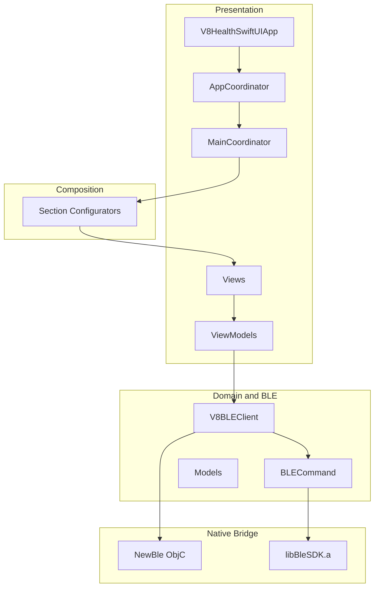
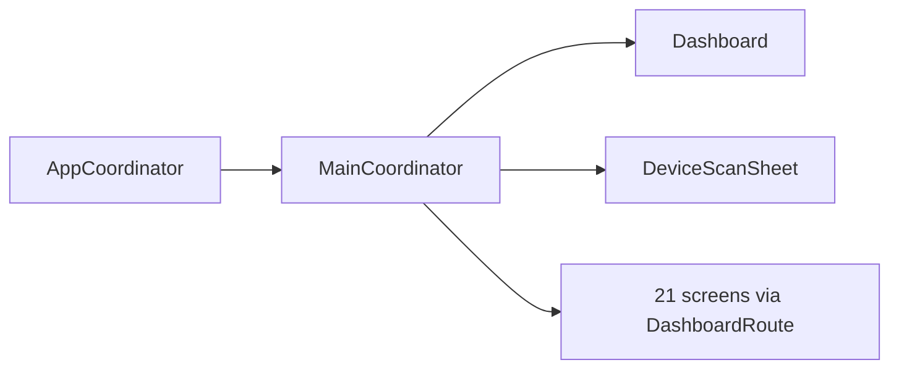
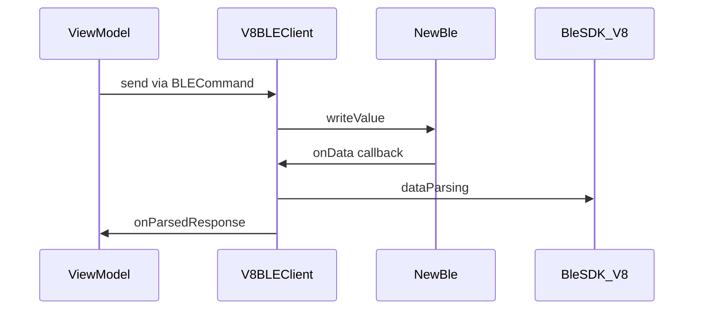

# V8 Health — SwiftUI

**iOS 17+ · SwiftUI · Swift 5 · MVVM · Coordinator Pattern**

Production-grade SwiftUI companion app for V8 health wearables. Connects over Bluetooth Low Energy (BLE), exposes all 21 SDK demo screens, and uses a layered architecture with Coordinators, Configurators, and `@Observable` ViewModels.

---

## Overview

V8 Health is a full SwiftUI port of the official V8 BLE SDK demo. The app scans for and pairs with a V8 wearable, then provides settings, live metrics, historical data sync, alarms, and log export — all from a single dashboard.

| | |
|---|---|
| **Platform** | iOS 17+ (iPhone, portrait) |
| **UI** | SwiftUI (`@Observable`, no Combine) |
| **Connectivity** | CoreBluetooth via Obj-C bridge + `libBleSDK.a` |
| **Architecture** | Coordinator → Configurator → MVVM |
| **Screens** | 21 feature screens across 4 sections |

---

## Features

| Section | Screens |
|---------|---------|
| **Settings** | Device Time, Personal Info, Step Goal, Device Info, Auto Measurement |
| **Live Data** | Real-time Steps, Activity Mode, ECG |
| **History** | Activity, Sleep, Heart Rate, Temperature, SpO2, HRV, PPI |
| **Other** | Alarms, Log Export |

**Device events:** The app surfaces SOS and Find Phone alerts from the wearable via `DeviceEventMonitor`.

---

## Requirements

- **Device:** Physical iPhone with Bluetooth (Simulator does not support BLE)
- **OS:** iOS 17.0 or later
- **Xcode:** 15.0 or later
- **Hardware:** V8 health wearable, powered on and in range
- **Signing:** Valid Apple Development Team configured in Xcode

---

## Getting Started

### Clone and open

```bash
git clone https://github.com/Jamisyed/V8HealthSwiftUI.git
cd V8HealthSwiftUI
open V8HealthSwiftUI.xcodeproj
```

### Run on device

1. Select your **Development Team** under Signing & Capabilities.
2. Choose a physical iPhone as the run destination.
3. Build and run (`⌘R`).
4. Tap **Scan** in the toolbar to find and connect your V8 device.

---

## Architecture

The app is organized into four layers: **Presentation**, **Composition**, **Domain/BLE**, and **Native Bridge**.



### Layer responsibilities

| Layer | Location | Responsibility |
|-------|----------|----------------|
| App entry | `V8HealthSwiftUIApp.swift` | Bootstraps `AppCoordinator` on launch |
| Coordinator | `Coordinator/` | Owns navigation state, route dispatch, scanner sheet |
| Configurator | `Configurator/` | Screen factories — DI-ready view assembly |
| View | `Views/` | Thin SwiftUI UI; no business logic |
| ViewModel | `ViewModels/` | `@Observable @MainActor`; sends commands, handles responses |
| Core | `Core/` | `V8BLEClient`, `BLECommand`, `HistorySyncHelper`, subscriptions |
| Models | `Models/` | `DashboardRoute`, connection state, domain structs |
| Components | `Components/` | Reusable UI — `SyncLogView`, `ECGWaveformView`, modifiers |
| Utilities | `Utilities/` | `AppLogger`, `ViewLifeTracker` |
| BLE bridge | `BLE/` | `NewBle` + `BleDelegateProxy` (Obj-C → Swift callbacks) |
| SDK | `BleSDK/` | Precompiled `libBleSDK.a` and V8 headers |

---

## Navigation

Navigation is handled by the **Coordinator pattern** — no UIKit view controllers, no auth flow.



| Type | File | Role |
|------|------|------|
| `AppCoordinator` | `Coordinator/AppCoordinator.swift` | Root coordinator; starts `MainCoordinator` |
| `MainCoordinator` | `Coordinator/MainCoordinator.swift` | `NavigationStack`, toolbar, sheet, route → screen |
| `DashboardRoute` | `Models/ConnectionModels.swift` | Typed navigation destinations |

### Configurator mapping

Each section configurator assembles the correct SwiftUI screen for a `DashboardRoute`:

| Configurator | Routes |
|--------------|--------|
| `DashboardConfigurator` | Root dashboard grid |
| `DeviceScanConfigurator` | BLE scanner sheet |
| `SettingsConfigurator` | `deviceTime`, `personalInfo`, `stepGoal`, `deviceInfo`, `autoMeasurement` |
| `LiveDataConfigurator` | `realtimeData`, `activityMode`, `ecg` |
| `HistoryConfigurator` | `activityHistory`, `sleepHistory`, `heartRate`, `temperature`, `spo2`, `hrv`, `ppi` |
| `OtherConfigurator` | `alarms`, `logExport` |

---

## BLE data flow

All device communication flows through a single `V8BLEClient` singleton.



### Per-screen subscription

ViewModels conform to `ResponseHandlingViewModel` and follow a strict lifecycle:

- **`onAppear`** → `subscribeToDevice()` — registers `onParsedResponse` handler
- **`onDisappear`** → `unsubscribeFromDevice()` — clears the handler

Only one screen subscribes at a time, matching the original Obj-C demo delegate pattern.

### History sync pagination

History screens use `HistorySyncHelper` with SDK sync modes:

| Mode | Value | Purpose |
|------|-------|---------|
| Start | `0` | Begin a new sync |
| Continue | `2` | Fetch next batch (after 50 records) |
| Delete all | `0x99` | Clear device history |

---

## Project structure

```text
V8HealthSwiftUI/
├── V8HealthSwiftUI.xcodeproj
├── README.md
├── .gitignore
├── BLE/                         # Obj-C CoreBluetooth bridge
│   ├── NewBle.m / NewBle.h
│   └── BleDelegateProxy.m / .h
├── BleSDK/                      # Precompiled V8 SDK
│   ├── libBleSDK.a
│   └── BleSDK_V8.h, DeviceData_V8.h, ...
└── V8HealthSwiftUI/
    ├── V8HealthSwiftUIApp.swift
    ├── ContentView.swift
    ├── Coordinator/
    │   ├── Coordinator.swift        # Base protocol
    │   ├── AppCoordinator.swift
    │   └── MainCoordinator.swift
    ├── Configurator/
    │   ├── Configurator.swift       # Base protocol
    │   ├── DashboardConfigurator.swift
    │   ├── DeviceScanConfigurator.swift
    │   ├── SettingsConfigurator.swift
    │   ├── LiveDataConfigurator.swift
    │   ├── HistoryConfigurator.swift
    │   └── OtherConfigurator.swift
    ├── Core/
    │   ├── V8BLEClient.swift
    │   ├── BLECommand.swift
    │   ├── HistorySyncHelper.swift
    │   ├── DeviceEventMonitor.swift
    │   ├── ViewModelSubscription.swift
    │   └── SDKHelpers.swift
    ├── Models/
    ├── ViewModels/                  # One ViewModel per screen
    ├── Views/                       # One View per screen
    ├── Components/
    └── Utilities/
```

---

## Development notes

### Logging

`AppLogger` provides structured, level-based logging. In **Release** builds, debug/info logs are stripped and sensitive fields (MAC address, personal info) are redacted.

### View lifecycle

`ViewLifeTracker` (`.trackLife()`) logs `onAppear` / `onDisappear` in **DEBUG** builds only, with deduplication for sheets.

### Build artifacts

`.derivedData/`, `build/`, `xcuserdata/`, and `.xcodebuild.log` are gitignored. Use a local derived data path when building from the CLI:

```bash
xcodebuild -project V8HealthSwiftUI.xcodeproj \
  -scheme V8HealthSwiftUI \
  -destination 'generic/platform=iOS' \
  -derivedDataPath .derivedData \
  build
```

### Branches

| Branch | Description |
|--------|-------------|
| `main` | Stable baseline |
| `coordinator` | Coordinator + Configurator architecture refactor |

---

## Acknowledgements

- **V8 BLE SDK** (`libBleSDK.a`) is proprietary software provided by the device manufacturer. Headers are included for integration; redistribution of the binary may be subject to license terms.
- UIKit Coordinator/Configurator sample code from iOSCodingChallenge was adapted to pure SwiftUI for this project.

---

## License

See repository license file. V8 SDK binary and headers are subject to separate vendor terms.
